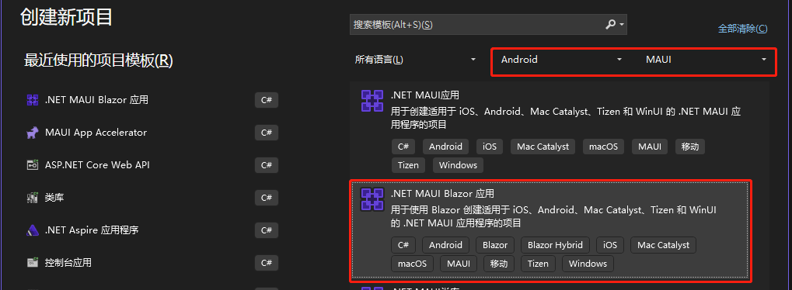
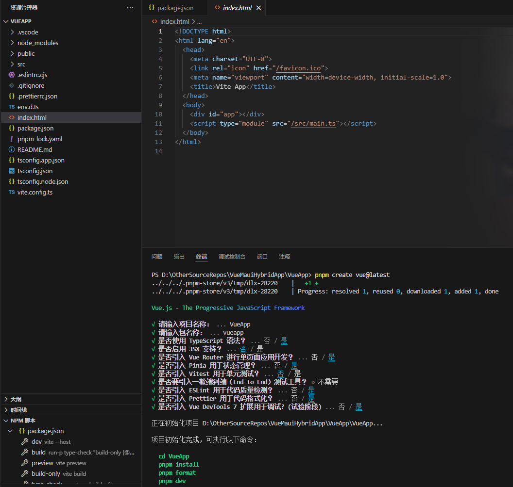
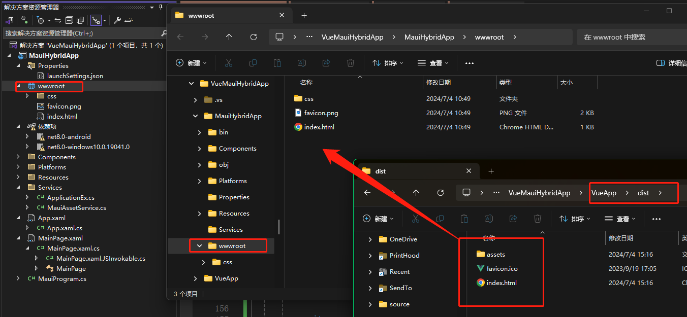

# VueMauiHybridApp

# 使用.Net MAUI Blazor Hybrid 打包和包装 Vue 应用

## 简介

使用.Net MAUI Blazor Hybrid 来打包和包装一个 Vue 应用。以便将 Vue 网页带到安卓 App、Window 桌面程序等等的其它平台上展示。

## 目录

- [不需要前后台互动](#最简单的)
- [简单的前后台互动](#简单的前后台互动)
- [完整的前后台互动](#完整的前后台互动)
    - [简单示例](#简单示例)

- [来自BlazorWebView的小问题](#一些小问题) 

## 先决条件

1. 创建.Net MAUI Blazor Hybrid 项目

    > 打开 Visual Studio 并创建一个新的.Net MAUI Blazor Hybrid 项目。并按照向导的指示完成项目的创建。

    

2. 创建 Vue 应用

    > 按照自己喜欢的方式创建一个 Vue 应用。

    > 比如：跟随 vite 的[官方文档](https://vuejs.org/guide/quick-start.html)创建一个 vue 应用。

    

---

## 不同的操作方式

### 最简单的

> 不需要.Net与Vue互动操作

最简单，不关注 JS 与.Net 之间的互动操作的，仅仅是将一个简单的 vue 网页打包成应用程序的。

1. 构建 vue 应用

2. 打开构建完成的目录（如 dist 目录），并复制所有文件

3. 打开 MAUI Blazor Hybrid 项目中的 wwwroot 目录，并粘贴覆盖文件

4. 运行 MAUI Blazor Hybrid 应用即可

    

---

### 简单的前后台互动

> 简单的 Vue 和.Net 互动，由Vue调用.Net方法的单向互动

比较简单，需要 vue 程序调用一些.Net 方法的，如检查应用权限、调用摄像头、扫描条形码、二维码等任务的。

#### 修改vue项目

- 打开 vue 项目的 index.html 文件，在&lt;body&gt;标签内添加以下代码

    ```js
    <script src="_framework/blazor.webview.js" autostart="false"></script>
    ```

    > :bulb:
    > Vue 开发阶段请直接忽略"找不到\_framework/blazor.webview.js"的错误

- 打开 vue 项目，同样是按照[微软官方教程](https://learn.microsoft.com/aspnet/core/blazor/javascript-interoperability/call-dotnet-from-javascript)编写 Javascript 方法

    ```js
    DotNet.invokeMethodAsync(
    MAUI_Project_ASSEMBLY_NAME,
    "CallDotNetFromJs",
    "this is Message"
    ).then((data) => {
    console.log(data);
    });
    ```

    > :information_source: 
    > 如果是 Typescript 项目，需要注意，要忽略 ts 检查器报的"DotNet"对象未定义的错误
    > 例如：使用以下方式忽略错误，

    ```ts
    // ./src/globals.d.ts
    declare interface Window {
    DotNet: any;
    }

    // ./src/views/HomeView.vue
    // 定义DotNet
    const DotNet = window.DotNet;
    // 使用DotNet
    DotNet.invokeMethodAsync(xxx, xxx);
    ```

- 构建之后复制文件粘贴到 wwwroot 目录中。 [参照“最简单的”这一部分](#最简单的)

#### 修改.Net MAUI Blazor Hybrid项目

- 打开.Net MAUI Blazor Hybrid 项目中的 MainPage.xaml.cs，按照[微软官方教程](https://learn.microsoft.com/aspnet/core/blazor/javascript-interoperability/call-dotnet-from-javascript)编写 JSInvokable 方法，例如：

    ```csharp
    [JSInvokable]
    public static async Task<string> CallDotNetFromJs(string message)
    {
        return await Task.FromResult("CallDotNetFromJs");
    }
    ```

- 运行

    > 运行前确保wwwroot目录中已经粘贴有最新构建的vue app

---

### 完整的前后台互动

> 完整的 Vue 和.Net 互动，除了Vue调用.Net方法，还有.Net调用Vue方法

除了[第二部分](#简单的前后台互动)所说的功能之外，还需要.Net 主动调用 vue 的 js 方法，以便通知 vue 程序的，如后台服务、任务的主动通知等功能。

#### 修改vue项目

> :information_source: 前置条件：请先按照[第二部分-简单的前后台互动](#简单的前后台互动)所说的步骤进行修改

- 打开 vue 项目的 index.html 文件，在&lt;body&gt;标签内添加以下代码

    ```html
    <div id="blazorapp"></div>
    ```
    
    > :bulb:
    > 不要覆盖原本的&lt;div id="app"&gt;&lt;/div&gt;，是新添加一行

    - 添加之后的index.html的&lt;body&gt;标签应该是这样子

        ```html
        <!-- 这是vite创建vue项目时就有的 -->
        <div id="app"></div>
        <script type="module" src="/src/main.ts"></script>

        <!-- 这是为了.Net/JS互操作而添加的 -->
        <div id="blazorapp"></div>
        <script src="_framework/blazor.webview.js" autostart="false"></script>
        ```

    > :bulb:
    > id="blazorapp"，id可随意取名，但是不能与vue项目中的其它id冲突。
    > 记住这个id，之后修改.Net项目时要用到

-   在适当的位置编写JS代码来接受.Net的调用

    ```js
    // ./src/views/HomeView.vue
    onMounted(() => {
      // 暴露js方法到window中，以便.Net调用JS
      window['JsAlert'] = (data: string) => {
        console.log('JsAlert:\t' + data)
        alert(data)
        return 'JsAlert Success'
      }
    })
    ```

    > 目的是将需要的方法暴露到window对象中，为了方便简单，此处直接使用 window['functionName'] 的方式进行处理

#### 修改.Net MAUI Blazor Hybrid项目

- 修改BlazorWebView的RootComponent的Selector
    - 将Selector的值修改为前面添加的id="blazorapp"的div的id值：**#blazorapp**
    ```xml
    <BlazorWebView
        x:Name="blazorWebView"
        HostPage="wwwroot/index.html">
        <BlazorWebView.RootComponents>
            <RootComponent ComponentType="{x:Type local:Components.Routes}" Selector="#blazorapp" />
        </BlazorWebView.RootComponents>
    </BlazorWebView>
    ```

- 修改Selector的值之后，便可在razor页面中使用JSRuntime调用vue页面中的js方法了
    ```csharp
    // Home.razor
    string result = await JSRuntime.InvokeAsync<string>("JsAlert", "Message From .Net");
    ```

#### 简单示例
> 最简单的.Net调用vue js函数的方法

1. 在合适的位置编写一个EventHandler
    ```csharp
    // 例如：在MainPage.xaml.cs中添加
    public static event EventHandler<string> CallJsFunction = null!;
    ```
2. 修改BlazorWebView.RootComponent的Selector（修改为 #blazorapp）
3. 修改MainLayout.razor，完全清理掉所有布局相关的标签，防止vue页面显示异常
    ```html
    <!-- ./Components/Layout/MainLayout.razor -->
    <!-- 整个razor文件仅有以下2行代码 -->
    @inherits LayoutComponentBase
    @Body
    ```
4. 修改Home.razor，同样是完全清理掉所有布局相关的标签
    ```csharp
    @page "/"
    @using System.Diagnostics
    @inject IJSRuntime JSRuntime

    @code {
        protected override Task OnInitializedAsync()
        {
            base.OnInitializedAsync();

            ProjectNamespane.MainPage.CallJsFunction += async (sender, args) =>
            {
                string result = await JSRuntime.InvokeAsync<string>("JsAlert", args);
            };

            return Task.CompletedTask;
        }
    }
    ```
5. 在需要的位置调用CallJsFunction?.Invoke(null!, "Message From .Net");即可
    ```csharp
    ProjectNamespane.MainPage.CallJsFunction?.Invoke(null!, "Message From .Net");
    ```

---

## 一些小问题

### 目前的BlazorWebView存在的问题及可能的解决方法

- 在安卓系统上使用&lt;input type="file" capture="camera" /&gt;时，不能调出拍照功能 
    - https://github.com/dotnet/maui/issues/884
    - 目前可行的解决方法 https://github.com/dotnet/maui/issues/884#issuecomment-1760299780
    - 可参考项目中的
        - [CustomActivityResultCallbackRegistry.cs](./MauiHybridApp/Platforms/Android/CustomActivityResultCallbackRegistry.cs)
        - [CustomMauiWebChromeClient.cs](./MauiHybridApp/Platforms/Android/CustomMauiWebChromeClient.cs)
        - [MainActivity.cs](./MauiHybridApp/Platforms/Android/MainActivity.cs)
        - [MainPage.xaml.cs](./MauiHybridApp/MainPage.xaml.cs)
