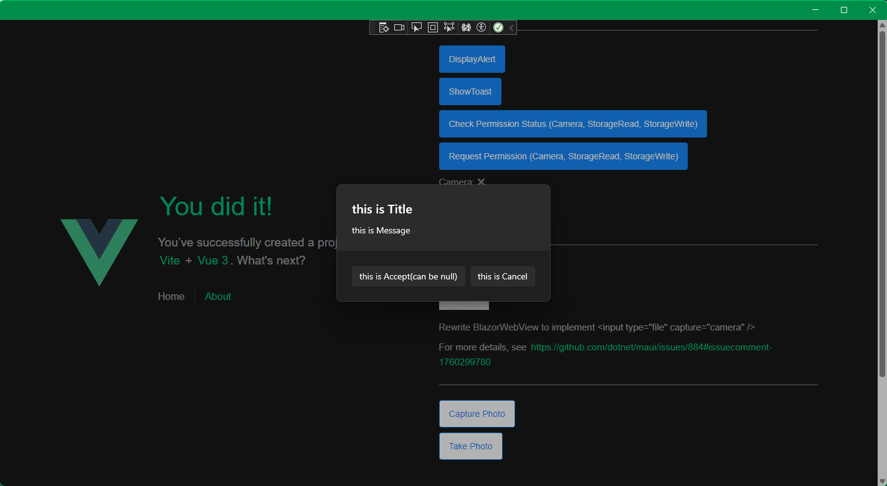
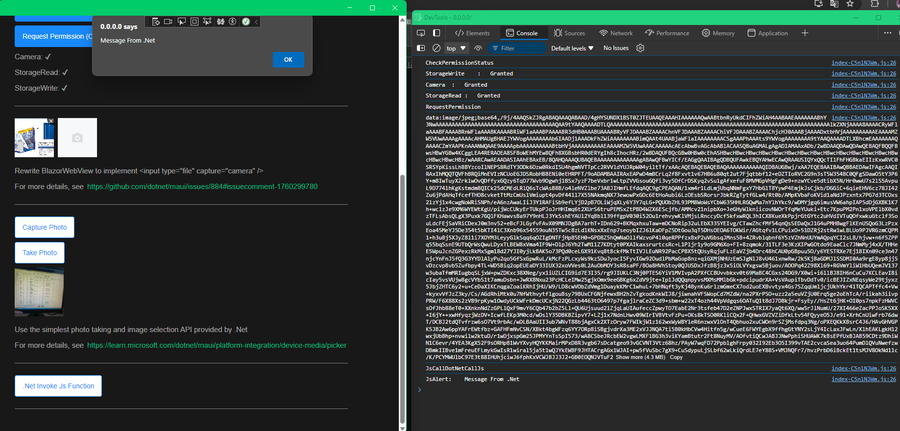
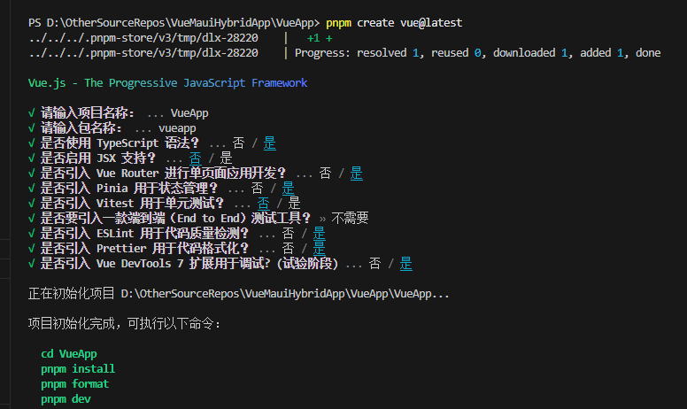

# VueMauiHybridApp

[中文](./README_CN.md)/[English](./README.md)

# using .Net MAUI Blazor Hybrid to package a Vue app

## Introduction

using .Net MAUI Blazor Hybrid to package a Vue app, so that the Vue web page can be displayed on Android App, Windows Desktop, etc.

## Contents

- [No vue and .Net interaction required](#the-easiest)
- [Simple vue and .Net interaction](#simple-vue-and-net-interaction)
- [Full vue and .Net interaction](#full-vue-and-net-interaction)
    - [Simple Example](#simple-example)

- [Some small issues from BlazorWebView](#some-small-problems) 

## Sample




## Prerequisite

1. Create .Net MAUI Blazor Hybrid Project

    > Open Visual Studio and create a new .Net MAUI Blazor Hybrid project. Follow the wizard to complete the project creation.
    
    

2. Create Vue App

    > Create a Vue app according to your preference.

    > For example: create a vue application following [the official documentation of vite.](https://vuejs.org/guide/quick-start.html)

    

---

## Different ways of operation

### The easiest

> Do not need .Net and Vue interaction

The easiest way, don't need .Net and Vue interaction, just package a simple vue web page as an application.

1. Build vue application

2. open the build folder (e.g. dist) and copy all files

3. Open the wwwroot folder in the MAUI Blazor Hybrid project and paste the copied files

4. Run the MAUI Blazor Hybrid application

    

---

### Simple vue and .Net interaction

> Simple Vue and .Net interaction, one-way interaction where Vue calls .Net methods

It is relatively simple and requires the vue program to call some .Net methods, such as checking application permissions, calling the camera, scanning barcodes, QR codes, etc.

#### Modify vue project

- Open the index.html file in the vue project. Add the following code in the &lt;body&gt; tag.

    ```js
    <script src="_framework/blazor.webview.js" autostart="false"></script>
    ```

    > :bulb:
    > When developing Vue, please ignore the error "Cannot find _framework/blazor.webview.js"

- Open the vue project, as well as follow the [Microsoft official tutorial](https://learn.microsoft.com/aspnet/core/blazor/javascript-interoperability/call-dotnet-from-javascript) to write Javascript methods

    ```js
    DotNet.invokeMethodAsync(
        MAUI_Project_ASSEMBLY_NAME,
        "CallDotNetFromJs",
        "this is Message"
    ).then((data) => {
        console.log(data);
    });
    ```

    > :information_source: 
    > If it is a Typescript project, please note that you should ignore the "DotNet" object undefined error reported by the ts checker
    
    > For example, use the following to ignore errors:

    ```ts
    // ./src/globals.d.ts
    declare interface Window {
        DotNet: any;
    }

    // ./src/views/HomeView.vue
    // Define DotNet
    const DotNet = window.DotNet;
    // Use DotNet
    DotNet.invokeMethodAsync(xxx, xxx);
    ```

- After building, copy the files to the wwwroot folder, as well as follow the [#The easiest](#the-easiest)

#### Modify .Net MAUI Blazor Hybrid project

- Open MainPage.xaml.cs in the .Net MAUI Blazor Hybrid project and follow the [Microsoft official tutorial](https://learn.microsoft.com/aspnet/core/blazor/javascript-interoperability/call-dotnet-from-javascript) to write a JSInvokable method, for example:

    ```csharp
    [JSInvokable]
    public static async Task<string> CallDotNetFromJs(string message)
    {
        return await Task.FromResult("CallDotNetFromJs");
    }
    ```

- Run/Debug/Build

    > Make sure that the wwwroot folder contains the latest build vue app

> :warning: **Confirm that the permissions are set properly**

> e.g. The required Android permissions have been added to the ./Platforms/Android/AndroidManifest.xml file.

---

### Full vue and .Net interaction

> Complete Vue and .Net interaction, in addition to Vue calling .Net methods, there are also .Net calling Vue methods.

In addition to the functions mentioned in [Part 2](#simple-vue-and-net-interaction), .Net is also required to actively call Vue's js method to notify the Vue program, such as active notification of background services and tasks.

#### Modify vue project

> :information_source: Prerequisites: Please follow the steps in [Part 2 - Simple vue and .Net interaction](#simple-vue-and-net-interaction) to make changes

- Open the index.html file in the vue project. Add the following code in the &lt;body&gt; tag.

    ```html
    <div id="blazorapp"></div>
    ```
    
    > :bulb:
    > Do not overwrite the original &lt;div id="app"&gt;&lt;/div&gt;, is a new line

    - After adding, the &lt;body&gt; tag should be like this

        ```html
        <!-- This is what Vite has when it creates a Vue project. -->
        <div id="app"></div>
        <script type="module" src="/src/main.ts"></script>

        <!-- This is for .Net/JS interaction -->
        <div id="blazorapp"></div>
        <script src="_framework/blazor.webview.js" autostart="false"></script>
        ```

    > :bulb:
    > id="blazorapp", The id can be named arbitrarily, but it cannot conflict with other ids in the vue project.
    
    > Remember this id, you will need it when you modify the .Net project later.

-   Write Javascript code to receive .Net calls

    ```js
    // ./src/views/HomeView.vue
    onMounted(() => {
      // Expose js methods to window, for .Net to call JS
      window['JsAlert'] = (data: string) => {
        console.log('JsAlert:\t' + data)
        alert(data)
        return 'JsAlert Success'
      }
    })
    ```

    > The purpose is to expose the required methods to the window object. For the sake of convenience and simplicity, window['functionName'] is used directly here.

#### Modify .Net MAUI Blazor Hybrid project

- Modify the Selector of BlazorWebView.RootComponent
    - Change the value of Selector to the id value of the div with id="blazorapp" added earlier: **#blazorapp**
    ```xml
    <BlazorWebView
        x:Name="blazorWebView"
        HostPage="wwwroot/index.html">
        <BlazorWebView.RootComponents>
            <RootComponent ComponentType="{x:Type local:Components.Routes}" Selector="#blazorapp" />
        </BlazorWebView.RootComponents>
    </BlazorWebView>
    ```

- After modifying the value of Selector, you can use JSRuntime in the razor page to call the js method in the vue page.   
    ```csharp
    // Home.razor
    string result = await JSRuntime.InvokeAsync<string>("JsAlert", "Message From .Net");
    ```

#### Simple Example
> The simplest way to call the vue js function in .Net

1. Write an EventHandler at the appropriate location
    ```csharp
    // For example: add in MainPage.xaml.cs
    public static event EventHandler<string> CallJsFunction = null!;
    ```
2. Modify the Selector of BlazorWebView.RootComponent (modify to #blazorapp)
3. Modify MainLayout.razor and completely clean up all tags to prevent abnormal display of Vue pages
    ```html
    <!-- ./Components/Layout/MainLayout.razor -->
    <!-- The entire razor file only has the following 2 lines of code -->
    @inherits LayoutComponentBase
    @Body
    ```
4. Modify Home.razor and completely clean up all tags.
    ```csharp
    @page "/"
    @using System.Diagnostics
    @inject IJSRuntime JSRuntime

    @code {
        protected override Task OnInitializedAsync()
        {
            base.OnInitializedAsync();

            ProjectNamespane.MainPage.CallJsFunction += async (sender, args) =>
            {
                string result = await JSRuntime.InvokeAsync<string>("JsAlert", args);
            };

            return Task.CompletedTask;
        }
    }
    ```
5. Just call CallJsFunction?.Invoke(null!, "Message From .Net"); where needed
    ```csharp
    ProjectNamespane.MainPage.CallJsFunction?.Invoke(null!, "Message From .Net");
    ```
    
> :warning: **Confirm that the permissions are set properly**

> e.g. The required Android permissions have been added to the ./Platforms/Android/AndroidManifest.xml file.

---

## Some small problems

### Problems and possible solutions to the current BlazorWebView

- In the Android system, the &lt;input type="file" capture="camera" /&gt; does not call out the camera function
    - https://github.com/dotnet/maui/issues/884
    - Currently available solutions https://github.com/dotnet/maui/issues/884#issuecomment-1760299780
    - The current solution can be found in the project
        - [CustomActivityResultCallbackRegistry.cs](./MauiHybridApp/Platforms/Android/CustomActivityResultCallbackRegistry.cs)
        - [CustomMauiWebChromeClient.cs](./MauiHybridApp/Platforms/Android/CustomMauiWebChromeClient.cs)
        - [MainActivity.cs](./MauiHybridApp/Platforms/Android/MainActivity.cs)
        - [MainPage.xaml.cs](./MauiHybridApp/MainPage.xaml.cs)
